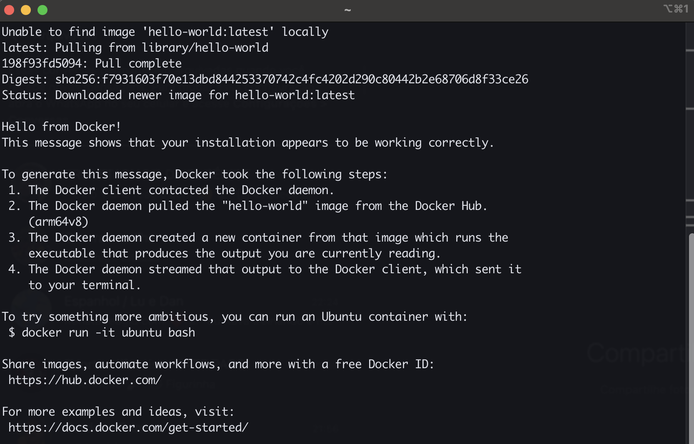
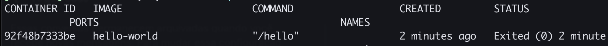
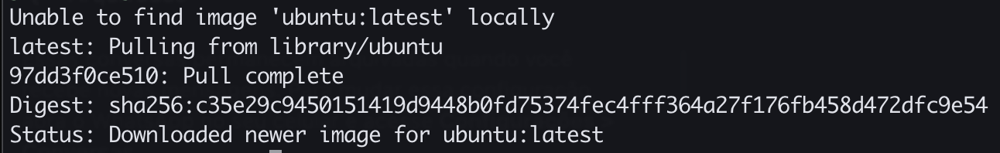

# Principais comandos

1. **docker ps** → lista todos os containers que estão rodando na máquina host.
   1. só mostra os containers ativos
2. **docker run hello-world** → executa o container de hello-world.
   1. O entrypoint do container executa o /hello
   2. O binário é executado
   3. container morre

3. **docker ps -a** → mostra todos os containers ativos e os que já executaram e morreram, em algum momento.

4. **docker run -it ubuntu bash**:
   1. **docker run**: executa o container
   2. **-it**: parâmetro informando que será no modo interativo
      1. Sempre colocar os parâmetros pós o run
   3. **ubuntu**: a imagem que quero baixar.
      1. **ubuntu:version**: podemos passar uma versão pós imagem. Caso não informamos, ele pega o latest.
   4. **bash**: Comando que vai ser executado no container depois que baixar a imagem.

1. **docker run -it --rm ubuntu bash**:
   1. abre o modo interativo da imagem ubuntu.
   2. quando saímos, usando o CRTL + D, ele remove o container da máquina
   3. Ou seja, o **--rm** remove automaticamente o container quando "matamos" a interação.

## Nginx

1. d**ocker run nginx**:
   1. Executa o container com a imagem do nginx e trava o terminal
   2. Informa que o container está sendo executado na porta 80
   3. mas ao acessar o localhost:80, não somos direcionados
   4. Isso ocorre, pois, a porta configurada no container não é a da máquina, mas do processo do container.
2. **docker run nginx -p 8080:80**
   1. Executa o container com a imagem do nginx e trava o terminal
   2. Informa que o container está sendo executado na porta 80
   3. Mapeia a porta do container (80) para a porta da máquina local que definimos no parâmetro (8080).
   4. Com essa porta, conseguimos acessar o **localhost:8080**
3. **docker run -d -p 8080:80 nginx**
   1. Faz basicamente tudo que o passo 2 realiza, com a diferente que o novo parâmetro -d faz um detach e libera o terminal, em vez de deixar travado e logando.
   2. Ou seja, ele faz uma execução em segundo plano
