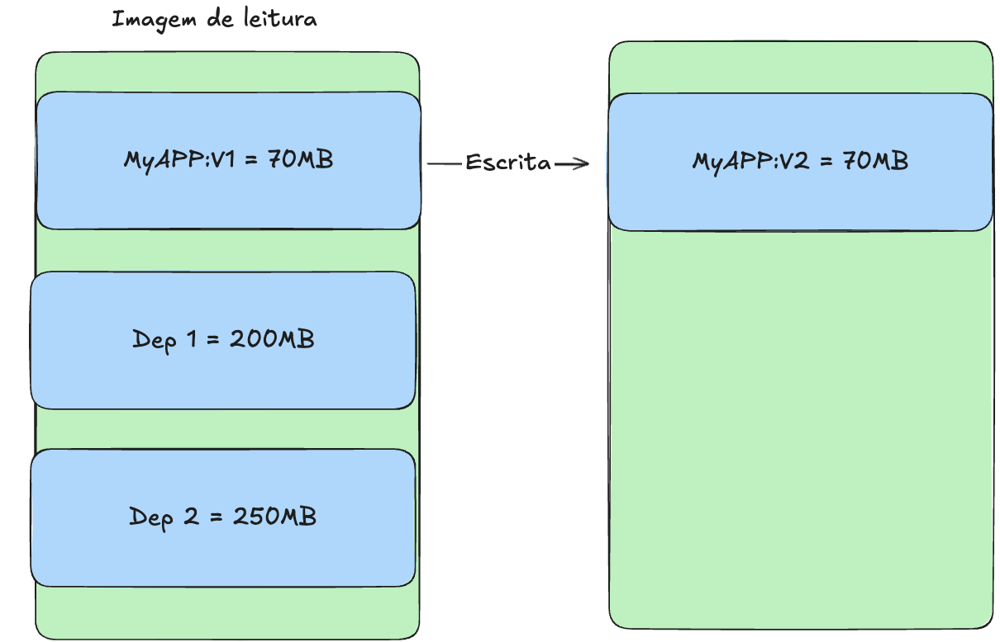

# Containers

# O que são containers?

Um container é um padrão de unidade de software que empacota código e todas as dependências de uma aplicação fazendo que a mesma seja executada rapidamente de forma confiável de um ambiente computacional para o outro.

## Namespace

Os namespaces são uma características fundamental que fornece isolamento aos contêineres. Eles permitem que cada container tenha sua própria visão do sistema, incluindo:

1. **PID namespace**: Isola os IDs de processos, permitindo que processos em containers diferentes tenham IDs iguais

2. **Network Namespace**: Fornece uma pilha de rede isolada, de modo que um container não possa ver ou inferir na rede do outro.

3. **Mount Namespace**: Permite que containers tenham sistemas de arquivos isolados, cada um com sua própria estrutura de diretório.

## Processos pai e filho

Quando um container é iniciado, ele cria um processo pai que, por sua vez, pode gerar processo filho. O processo pai geralmente será responsável pela execução do código da aplicação, enquanto os processos filhos podem gerenciar tarefas específicas ou sub-processos necessários para a operação.

## Cgroups (Control groups)

São uma parte fundamental da funcionalidade do Docker, permitindo um gerenciamento eficiente, segudo e isolado de recursos em um ambiente de containers, o que é vital a performance e confiabilidade das aplicações em containers.

1. **Limitação de recursos**: Docker utiliza cgroups para definir limites sobre os recursos que cada container pode usar. Isso inclui

   1. **CPU**: Podemos especificar quantos ciclos de CPU um container pode consumir
   2. **Memória**: É possível limitar a quantidade de RAM que um container pode utilizar, prevenindo problemas de uso excessivo que poderiam afetar outros containers ou o sistema host. 3.** Disco e rede**: Docker também pode usar cgroups para gerenciar o uso de I/O em disco e largura de banda de rede.

2. **Isolamento**: Cada container docker é executado em seu próprio espaço de cgroup, garantindo que os limites definidos não interfiram entre si. Isso significa que, mesmo que múltiplos containers estejam rodando no mesmo host, eles têm suas próprias quotas de recursos, o que ajuda a manter o desempenho e estabilidade.

3. **Monitoramento**: Docker pode usar informações do cgroup para fornecer métricas sobre o uso de recursos.
   1. Uso do CPU
   2. Uso da memória
   3. Uso de I/O

## File System

São essenciais para gerenciar como os dados são armazenados, acessados e manipulados dentro dos containers.

### Imagens e Containers:

Uma imagem Docker é uma representação estática do sistema de arquivos que inclui a aplicação e todas as suas dependências. Quando um container é iniciado a partir de uma imagem, um sistema de arquivos somente leitura é criado a partir da imagem. Qualquer alteração feita no container (como a criação de novos arquivos ou a modificação de um arquivo existente) é feita na camada "top" que é gravável, permitindo que as alterações não afetem a imagem original.

## Imagens

Em docker, uma imagem é um snapshot de um sistema de arquivos que contém tudo o que é necessário para executar uma aplicação, incluindo o código, bibliotecas e dependências. As imagens são imutáveis e servem como base para criar containers.

### Camadas

As imagens são formadas por várias camadas:

1. **Camadas em Stack**: Cada alteração feita em uma imagem resulta em uma nova camada. Por exemplo, caso eu adiciono um programa ou biblioteca, uma nova camada é criada.

2. **Somente leitura**: Todas as camadas, exceto a última (gravável), são somente leituras. Isso significa que containers criados a partir da mesma imagem compartilham as camadas existentes.

3. **Eficiência**: Esse modelo de camadas permite que várias imagens compartilhem camadas comuns, economizando espaço em disco e melhorando a eficiência.

## Dockerfile

Um dockerfile é um arquivo de texto que contém uma série de instruções e comandos usados para criar uma imagem Docker. Ele define como a imagem deve ser construída, especificando os passos necessários para configurar o ambiente e instalar as dependências da aplicação.

1. **Instruções básicas**:
   1. **FROM**: Define a imagem base a partir da qual a nova imagem será construída.
   2. **RUN**: Executa comandos durante a construção da imagem, como a instalação de pacotes.
   3. **COPY ou ADD**: Copia os arquivos ou diretórios do sistema de arquivos host para a imagem.
   4. **CMD ou ENTRYPOINT**: Especifica o comando que deve ser executado quando um container é iniciado a partir de uma imagem.
2. **Camadas**: Cada instrução no Dockerfile cria uma nova camada na imagem, permitindo que as alterações sejam gerenciadas de forma eficiente.
3. **Estrutura**: Um Dockerfile geralmente segue uma estrutura sequencial, começando a definição da imagem base, passando pela instalação de dependências e finalizando com a configuração da aplicação
4. **Portabilidade**: Os dockerfiles são portáteis, permitindo que qualquer pessoa reproduza o mesmo ambiente de imagem simplesmente executando o Dockerfile em seu próprio sistema.
